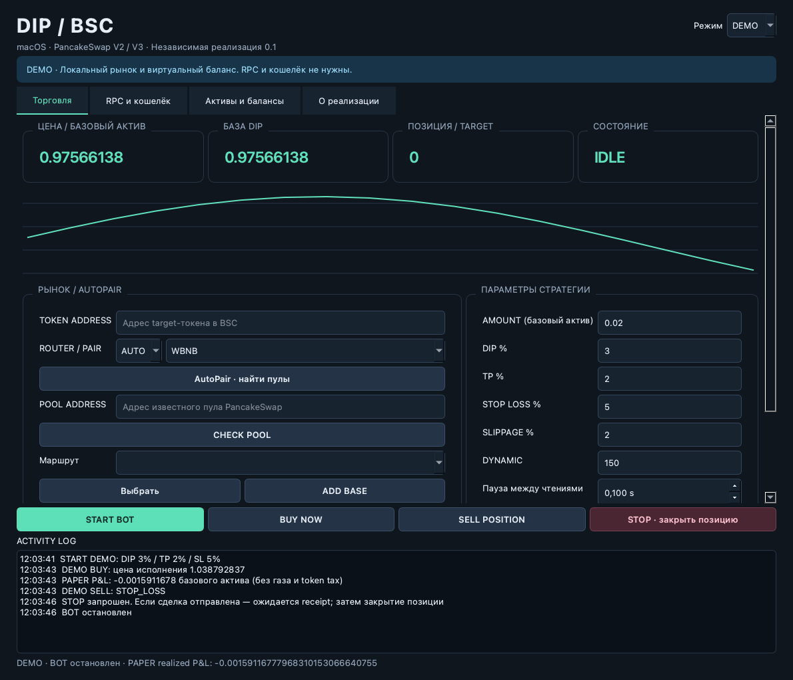

<div align="center">

# DipBot Mac

**Рабочее место для DIP-торговли в BSC на macOS**

PancakeSwap V2 / V3 · Python · PySide6 · macOS Keychain

[](https://github.com/Hostlife22/dipbot-mac/actions/workflows/ci.yml)


[Руководство](README_RU.md) · [Архитектура](docs/ARCHITECTURE_RU.md) · [Разработка](CONTRIBUTING.md) · [История изменений](CHANGELOG.md)

</div>



Независимая реализация по документации и статическому разбору NRNF DipBot v1.4.14. Исходники доступны в этом репозитории; Windows EXE и авторская лицензия для запуска не нужны.

> **Экспериментальная версия.** LIVE отправляет реальные транзакции. Проверены локальные тесты, запуск macOS-приложения и чтение BSC; реальные сделки пока не проверялись. Стратегия реконструирована и не подтверждена как точная копия оригинала. Подробности — в [отчёте проверки](docs/VALIDATION_RU.md).

## Возможности

| Область | Реализовано |
| --- | --- |
| Рынок | Проверка канонических пулов PancakeSwap V2/V3, AutoPair, 42 базовых актива |
| Торговля | Ручные BUY/SELL, автоматический DIP-вход, TP, Stop Loss, Dynamic |
| Управление активами | Converter BNB ↔ base, Sweep зарегистрированных токенов |
| Исполнение | Точечный approve, minOut, ожидание receipt, журнал перед отправкой |
| Хранение | Ключ и опционально RPC в macOS Keychain, публичное состояние на диске |

## Быстрый старт

Нужны macOS и [uv](https://docs.astral.sh/uv/getting-started/installation/). Зависимости устанавливаются по `uv.lock`.

```bash
git clone https://github.com/Hostlife22/dipbot-mac.git
cd dipbot-mac
uv sync --frozen --python 3.12
uv run --frozen python launcher.py
```

Оставьте **DEMO** и нажмите **START BOT**: RPC, private key и средства не нужны. В подготовленном окружении можно запускать `START_MAC.command` двойным кликом.

| Режим | Котировки | Сделки |
| --- | --- | --- |
| **DEMO** | Синтетическая локальная цена | Виртуальные |
| **PAPER** | Настоящие данные BSC | Виртуальные |
| **LIVE** | Настоящие данные BSC | Реальные |

Для PAPER/LIVE настройте RPC и выберите проверенный пул. **AMOUNT измеряется в базовом ERC-20 активе пула**, включая WBNB, а не обязательно в нативном BNB. Пошаговая настройка, поведение STOP и восстановление после ошибки — в [руководстве](README_RU.md).

## Сборка приложения

```bash
./BUILD_MAC.command
open "dist/DipBot Mac.app"
```

Сборка использует архитектуру текущего Python-окружения. Локально проверен Intel x86_64; нативную arm64-сборку нужно создавать и проверять отдельно. Подпись — ad-hoc, без нотарификации Apple.

Исходный Git-репозиторий не содержит `.app`, `.venv` и Windows-дистрибутив. Workflow [Build macOS](.github/workflows/build-macos.yml) можно запустить вручную в Actions: после успешных проверок он сохраняет отдельные ZIP-артефакты для Intel и Apple Silicon, а также SHA-256. Автоматической публикации релизов нет.

## Разработка

```bash
uv sync --frozen --group dev
uv run --frozen pytest -q
QT_QPA_PLATFORM=offscreen uv run --frozen python launcher.py --smoke-test
```

CI запускает тесты и GUI smoke test на macOS для обеих архитектур. В smoke test временный случайный ключ используется только для локальной проверки подписи; транзакции не отправляются и пользовательский Keychain не читается.

```text
dipbot/             Интерфейс, стратегия, BSC-клиент, исполнение и хранение
tests/              Локальные тесты с заглушками исполнения
tools/              Статический анализ Windows EXE
docs/               Архитектура, разбор, отчёт проверки и DEMO-скриншот
.github/            CI, сборка macOS, шаблоны issues и pull requests
```

## Документация

- [Настройка, торговля и восстановление](README_RU.md)
- [Архитектура и поток исполнения](docs/ARCHITECTURE_RU.md)
- [Участие в разработке](CONTRIBUTING.md)
- [Работа с чувствительными данными](SECURITY.md)
- [Разбор nonce, known-transaction и receipt](docs/NONCE_RECOVERY_RU.md)
- [Внутренние методы Sweep и перенесённая симуляция](docs/SWEEP_INTERNALS_RU.md)
- [Уточнение REMOVE, ошибок Sweep и защищённого формата](docs/FOLLOWUP_PARITY_RU.md)
- [Разбор AutoPair, ADD, Sweep и настроек](docs/WORKFLOW_PARITY_RU.md)
- [Что удалось восстановить из оригинала](docs/REVERSE_ENGINEERING_RU.md)
- [Что проверено и что осталось непроверенным](docs/VALIDATION_RU.md)

