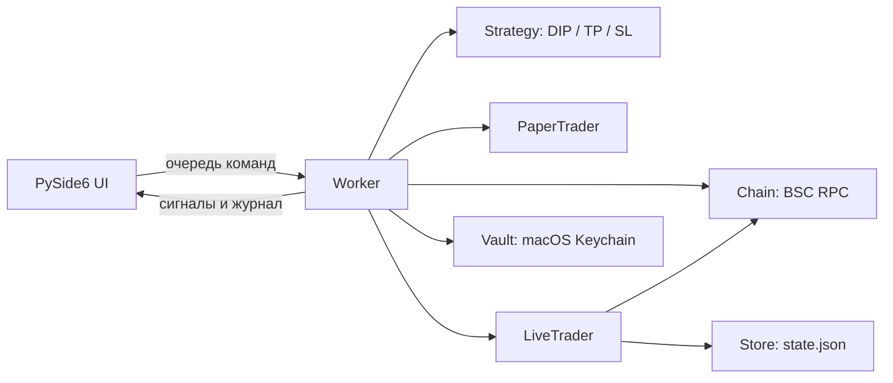

# Архитектура

DipBot Mac — локальное desktop-приложение. Интерфейс и последовательный Worker работают в разных потоках. Все реальные операции проходят через LiveTrader; DEMO/PAPER используют отдельную виртуальную модель.

## Модули

| Модуль | Ответственность |
| --- | --- |
| `app.py` | Виджеты, подтверждение LIVE-действий, команды Worker, отрисовка сигналов |
| `worker.py` | Очередь команд, чтение цены, запуск стратегии, позиции, STOP, Sweep и сверка |
| `strategy.py` | Чистая логика сигналов; Settings; целочисленные raw_amount и minimum_out |
| `chain.py` | chainId/свежесть блока, ABIs, проверка factory/pool, цена и котировки |
| `trader.py` | LiveTrader: approve, swap, конвертация, receipt; PaperTrader: виртуальный учёт |
| `storage.py` | Keychain и атомарное сохранение публичного состояния |
| `profiles.json` | Публичные имена и адреса базовых активов, извлечённые из EXE |

## Путь LIVE-сделки

1. Worker получает подтверждённую команду или сигнал стратегии. Проверяются режим, выбранный пул и состояние позиции.
2. `LiveTrader.begin()` сохраняет намерение операции. Наличие незавершённой операции блокирует новую.
3. Проверяется пул, официальный router, баланс, котировка и minOut. При необходимости отправляется approve точной суммы.
4. После approve котировка обновляется; прежний minOut не ослабляется.
5. Перед каждым broadcast проверяются chainId, свежесть блока, pending nonce, баланс BNB и лимит газа. Hash подписанной транзакции сохраняется до отправки.
6. Ожидается receipt. При успехе swap проверяется фактическое изменение баланса, Worker обновляет позицию и завершает запись операции.
7. При неизвестном результате операция остаётся в журнале. Автоматической повторной отправки нет; сверка и сброс учёта требуют явного действия пользователя.

STOP передаётся через `threading.Event`, поэтому запрос можно подать во время ожидания receipt. Worker обрабатывает его после завершения текущего шага и пытается закрыть учтённую позицию. Неизвестный статус транзакции блокирует новое исполнение, в том числе автоматический выход.

## Данные

| Данные | Хранилище |
| --- | --- |
| Private key и опционально RPC | macOS Keychain, сервис `DipBotMac` |
| Публичный адрес, маршруты, позиции, история/незавершённая операция | `~/Library/Application Support/DipBotMac/state.json` |
| Каталог встроенных активов | `dipbot/profiles.json` |
| Сборки | `dist/`, вне Git |

Store записывает временный файл, выполняет fsync и атомарную замену. Keychain не имеет fallback в открытый текст. Подробности восстановления и ограничения при dropped-транзакциях описаны в [руководстве](../README_RU.md).

## Границы проверок

Unit-тесты проверяют логику с подменёнными RPC и отправкой. GUI smoke test проверяет импорт зависимостей, временную локальную подпись, каталог и запуск окна. Они не подтверждают фактическое исполнение сделки в сети.

Проверки через публичный RPC, ручная торговля выделенным кошельком, испытания других архитектур и длительные прогоны учитываются отдельно в [отчёте](VALIDATION_RU.md). Не следует заменять его результаты одним зелёным CI.

