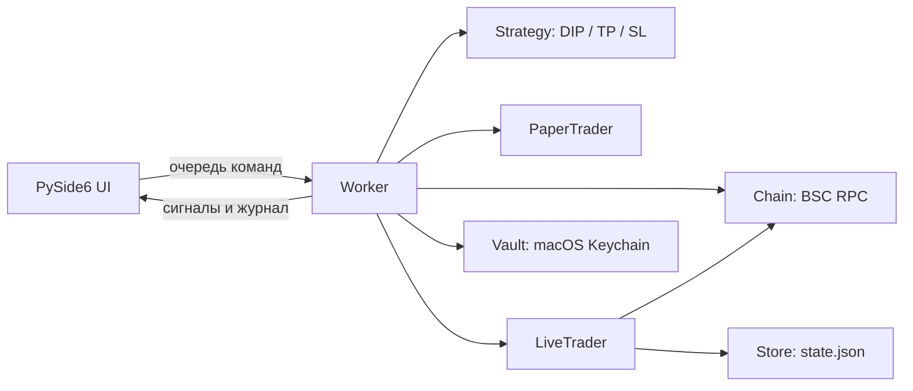

# Архитектура

DipBot Mac — локальное desktop-приложение. Интерфейс и последовательный Worker работают в разных потоках. Все реальные операции проходят через LiveTrader; DEMO/PAPER используют отдельную виртуальную модель.

## Структура и границы

| Пакет | Ответственность |
| --- | --- |
| `domain/` | Стратегия, настройки и политики, численные проверки, форматирование USD; только стандартная библиотека |
| `application/` | Последовательный Worker, сценарий Sweep с явными зависимостями, безопасные сообщения ошибок |
| `market/` | BSC RPC, пулы и ABI, обнаружение маршрутов, WSS, свежесть и резервные чтения |
| `execution/` | LIVE-исполнение, отдельная PAPER-модель, сверка receipt, отмена, учёт |
| `persistence/` | Атомарное хранилище, Keychain, настройки и реестры |
| `ui/` | Главное окно и события, построение экранов, график, тема, асинхронный USD feed |
| `research/` | Архив рынка, replay и проверка параметров стратегии |
| `observability/` | Тайминги, этапы исполнения и диагностика процесса |
| `checks/` | Упаковываемые сценарии проверки UI/PAPER и read-only RPC guard |
| `bootstrap.py` | Аргументы запуска, выбор режима, блокировка второго экземпляра и жизненный цикл приложения |
| `app.py` | Стабильная точка входа `dipbot.app:main` для CLI и launcher |

`tools/` содержит внешние команды проверки. Приложение не импортирует `tools` или `tests`: всё необходимое для установленных CLI-режимов входит в wheel и `.app`.

Зависимости направлены от UI к application, затем к execution/market/persistence и domain. Нижние пакеты не импортируют UI, application или checks. Домен не зависит от Qt, web3, сети или хранилища. Эти ограничения проверяет `tests/test_architecture.py`.

Это разделение по ответственности, а не обещание полной независимости всех адаптеров. Например, реестры используют проверку адресов из market; `Worker` остаётся адаптером QThread и координатором последовательного исполнения. `Window` хранит состояние представления и обрабатывает события. Не создавайте параллельных владельцев позиции, очереди или журнала ради дальнейшего разделения.

## Выделенные компоненты

- `ui/chart.py` рисует график; `ui/layout.py` строит экраны на переданном окне. Построение не запускает торговую стратегию. `ui/window.py` связывает элементы управления с командами и событиями.
- `application/sweep.py` получает store, chain, live, strategy, rates, STOP-event и callbacks явно. Worker создаёт сервис с текущим подключением и кошельком при вызове Sweep. Сервис не знает о Qt-виджетах.
- `execution/paper.py` считает виртуальные позиции без RPC или подписи. `execution/trader.py` отвечает за LIVE. `execution/reconciliation.py` проверяет записанные receipts, не отправляя сделки повторно.
- `domain/usd.py` содержит чистые вычисления; Qt-запросы USD вынесены в `ui/usd_feed.py`.

Внутренние импорты используют полные пути пакетов. Старые плоские пути вроде `dipbot.worker` заменены в приложении, тестах и инструментах; совместимость внешних пользовательских скриптов требует обновления их импортов. Публичная команда запуска, формат состояния, ключи Keychain и пути пользовательских данных сохранены.

## Путь LIVE-сделки

1. Worker получает подтверждённую команду или сигнал стратегии. Проверяются режим, выбранный пул и состояние позиции.
2. `LiveTrader.begin()` сохраняет намерение операции. Наличие незавершённой операции блокирует новую.
3. Для BUY вычисляется нижняя граница выхода из цены сигнала. Проверяется пул, официальный router, баланс, котировка и minOut. При необходимости отправляется approve точной суммы.
4. После approve котировка обновляется; прежний minOut не ослабляется.
5. Перед каждым broadcast проверяются chainId, свежесть блока, pending nonce, баланс BNB и лимит газа. Hash подписанной транзакции сохраняется до отправки.
6. Ожидается receipt. При успехе swap проверяется фактическое изменение баланса, Worker сохраняет количество позиции, читает цену после receipt для базы TP/SL и завершает запись операции. Если это чтение не удалось, количество уже сохранено, а блокировка остаётся.
7. При неизвестном результате операция остаётся в журнале. Автоматической повторной отправки нет; сверка и сброс учёта требуют явного действия пользователя.

STOP передаётся через `threading.Event`, поэтому запрос можно подать во время ожидания receipt. Worker обрабатывает его после завершения текущего шага и пытается закрыть учтённую позицию. Неизвестный статус транзакции блокирует новое исполнение, в том числе автоматический выход.

## Данные

| Данные | Хранилище |
| --- | --- |
| Private key и опционально RPC | macOS Keychain, сервис `DipBotMac` |
| Публичный адрес, маршруты, позиции, история/незавершённая операция | `~/Library/Application Support/DipBotMac/state.json` |
| Каталог встроенных активов | `dipbot/profiles.json` |
| Сборки | `dist/`, вне Git |

Store записывает временный файл, выполняет fsync и атомарную замену. Keychain не имеет fallback в открытый текст. Подробности восстановления и ограничения при dropped-транзакциях описаны в [руководстве](../README_RU.md).

## Границы проверок

Unit-тесты проверяют логику с подменёнными RPC и отправкой. GUI smoke test проверяет импорт зависимостей, временную локальную подпись, каталог и запуск окна. Они не подтверждают фактическое исполнение сделки в сети.

Проверки через публичный RPC, ручная торговля выделенным кошельком, испытания других архитектур и длительные прогоны учитываются отдельно в [текущем статусе](CURRENT_STATUS_RU.md). Не следует заменять его результаты одним зелёным CI.

Конвертер использует quoteExactInput/getAmountsOut для полного пути и один swap. Native BUY не требует отдельного wrap; V3 SELL возвращает WBNB, затем выполняется отдельный unwrap дельты. При save error в finish журнал остаётся заблокирован в памяти. STOP отменяет ещё не начатые торговые команды и очищает оставшуюся очередь. См. [аудит соответствия](https://github.com/Hostlife22/dipbot-mac/blob/89e3a4f/docs/PARITY_AUDIT_RU.md).

## Дальнейшее разделение компонентов

`application/worker.py` владеет очередью, состоянием и жизненным циклом потока.
`commands.py` выполняет команды и настройку, `market_observation.py` наблюдает рынок,
`positions.py` выполняет вход и выход. Они принимают один текущий runtime явно;
не создают копий позиции, дополнительных очередей или параллельных исполнителей.
Методы Worker остаются тонкими точками вызова для UI и тестовых адаптеров.

`ui/window.py` связывает сигналы и управляет жизненным циклом окна. Контроллеры
`autopair_controller`, `settings_controller`, `recovery_controller` и
`position_presenter` работают с тем же представлением, не дублируя его состояние.
Тема и построение экранов остаются общими; подтверждения LIVE сохраняются.

Очередь принимает `Command` с `CommandKind` и снимком payload. Qt остаётся
wire-адаптером `(name, payload)`; `Event`/`EventKind` проверяются на отправке и
приёме. Опечатки в командах и полях отклоняются до постановки в очередь.
Секретный payload не включается в repr команды. Бизнес-проверки сумм и прав
на действия остаются в существующих обработчиках.
